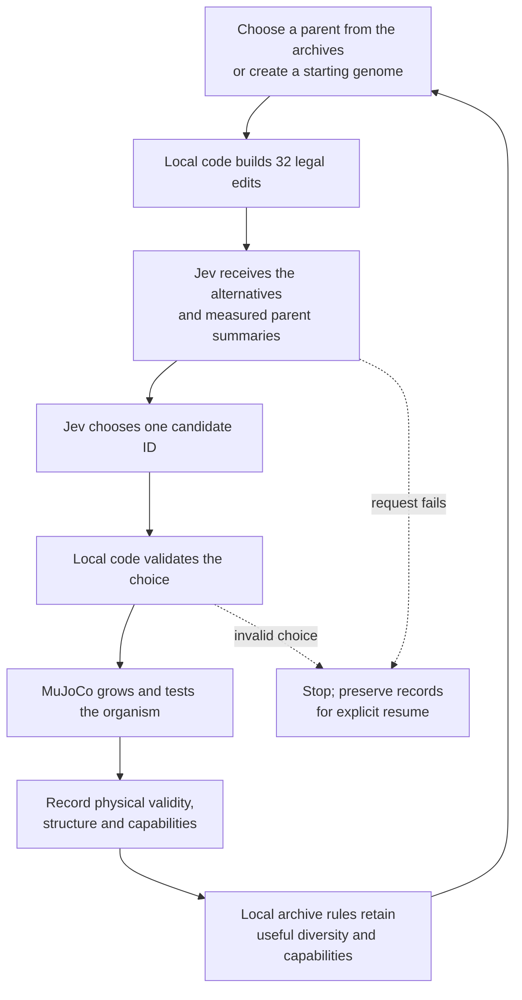

# How Jev guides Tendril

Jev chooses **which proposed organism to test next**. Tendril grows that organism in 3D, measures what happens, and keeps physically valid examples that contribute to its archives. Every evolutionary candidate passes through Jev, including the first generation.



The checked-in experiment uses 32 alternatives per decision; this is configurable. Proposals change an inherited developmental program: for example a branch direction, joint stiffness, contraction phase, signaling strength, module connection, tissue differentiation or donor module. These are concrete validated genomes before Jev sees them. Legal here means structurally valid and within parameter bounds; a legal genome can still fail its physical test.

## What crosses the API boundary

The selection instruction adopted September 25, 2026 prioritizes novelty and developmental stepping stones:

```text
Choose one candidate worth physically testing. Prioritize novelty over immediate performance or usefulness.

Value stepping stones: simple, passive, or unfinished forms may open new directions. Favor opportunities to discover something different over polishing what already works.

Judge novelty from the evidence provided. Simulation will determine physical validity.

Select one supplied candidate ID.
```

This sets Jev's selection preference. Archive admission still uses the structural-diversity and local-capability rules described below; prompt wording alone does not establish a novelty-first ranking across the whole search. The instruction is included in saved requests and their cache hashes.

| Sent to Jev | Returned and checked |
| --- | --- |
| Parent genome; measured structure, behavior, capabilities and accounting when available | One candidate ID from the supplied pool |
| Parent lineage, mutation attempt/admission counts (including initialization), and the last eight completed trial summaries | Probabilities covering exactly that pool and a confidence value |
| Each alternative's ID, edit description, kind and complete resulting genome | Resolved model name and available usage data |

The choice must have a highest probability, and the probabilities must be finite, bounded and sum to one within reported precision. Live two-decimal replies are accepted only when their rounding intervals contain a unit total; raw probabilities are preserved. Confidence is recorded as part of the response; it cannot override physical validity. The current request contains structured numerical/genome data, not images, video or the entire archive. Initial candidates have a starting genome, mutation history and recent completed trial summaries, but no measured parent rollout. Recent trials include failed initialization/reseeding attempts so their physical failures inform later choices.

Jev operates once per candidate selection, outside the physical timestep loop. Inherited local controllers handle contraction and contact/strain feedback; regulatory signals propagate locally throughout development and adulthood. MuJoCo computes mechanics and collisions. No API call is needed for an organism to take its next physical step.

## One batch in the current implementation

With `configs/evolution.json`, local code prepares four separate pools and obtains four Jev decisions sequentially. The four selected candidates then run in up to four CPU workers. Each gets three seconds of development and, if valid, four independent two-second adult assays: undisturbed, push, load and nearby loose object. All adult assays begin from the same adult state.

Results enter the archives in submission order, so worker completion order cannot alter selection. The next batch sees the updated archives and mutation history. Decisions within a batch use the previously completed archive state; they do not see other candidates' pending outcomes.

The first eight candidates start from seeded branching genomes, with Jev choosing an edit for each. The same procedure supplies a candidate if the selected archive has no parent. Later, local code alternates between structural and behavioral archive views, samples a niche and parent, and samples a donor for possible recombination. Jev selects among the resulting edits; it does not currently choose the parent or donor itself.

The structural archive protects its first occupant in each niche and retains descriptor diversity, including passive precursors. The behavioral archive keeps local capability tradeoffs across support, motion, recovery, manipulation and efficiency. There is no single global champion or single task score. Invalid bodies remain in the experiment records but cannot enter either archive. Mutation history summarizes archive admission, not a Jev-issued survival judgment.

## Failure, replay and remaining work

A missing `TYPESAFE_API_KEY` stops before the search starts. After startup, atomic checkpoints retain the last completed batch; even the first request has a pre-selection checkpoint. A request error or invalid response stops the run. Explicit resume reconstructs the pending work from the saved random state, reuses matching successful decisions and retries failed requests. It never substitutes an unguided candidate. An interrupted batch can require repeating its physical evaluations.

Records preserve candidate pools, chosen edits, seeds, lineage, requests, responses, failed attempts, source/runtime versions and available usage. The transport receives credentials through the process environment; the CLI can load a private local key file. Credentials never enter experiment records. Resume requires compatible code, runtime and experiment settings; the evaluation budget and operational limits may increase, and the worker count may change.

This architecture is implemented and tested offline. Live selection and usage reporting have been validated with pinned `jev-1.13.0`. Request/dollar limits reserve potentially billed attempts before dispatch; a wall deadline stops new requests/batches while in-flight work may finish. The CLI also accepts a private local key file. See [live readiness](LIVE_READINESS.md) for end-to-end evidence. Archive admission currently uses the primary rollout; automatic qualification across refined timesteps and repeated perturbations remains work to do. Guidance effectiveness and sustained evolutionary diversity have not been demonstrated. The available API context is bounded and does not give Jev a complete history or explicit map of unexplored archive niches.

Implementation: [`search.py`](../src/tendril/search.py), [`guidance.py`](../src/tendril/guidance.py), [`genome.py`](../src/tendril/genome.py), [`simulation.py`](../src/tendril/simulation.py). Physical conventions and remaining research limits are in [IMPLEMENTATION.md](IMPLEMENTATION.md) and [NEXT.md](NEXT.md).
